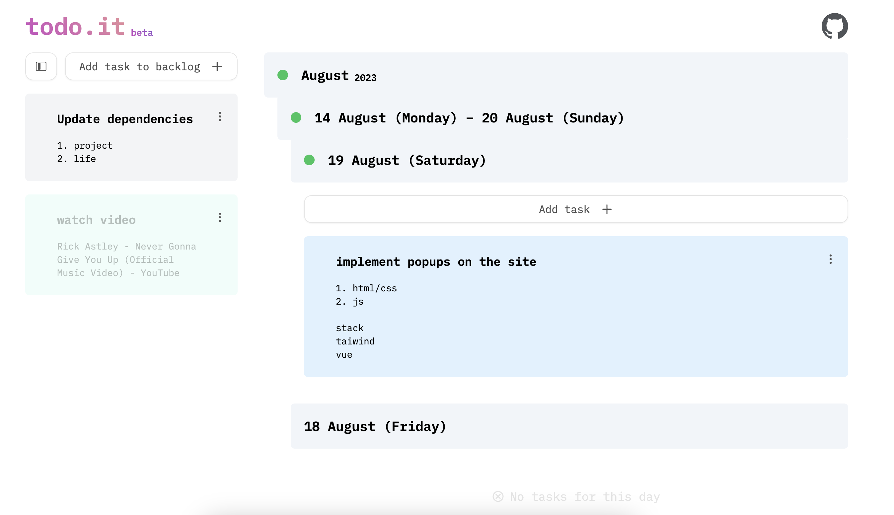
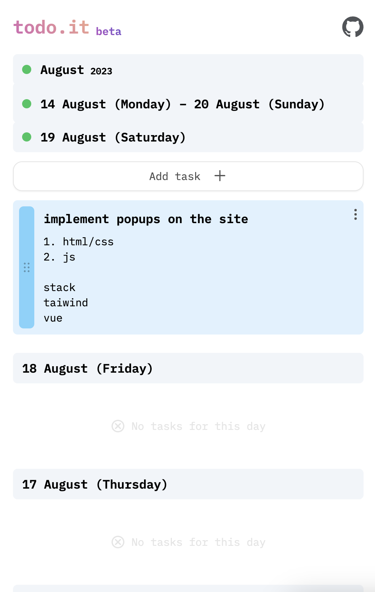

# todo.it – another todo app but with features

App for operational planning and decomposition of tasks for 1-4 weeks ahead


## Idea

The idea of the application is to transform a text file that I used for planning...

```txt
Monday (date)
- task
- task
- task

Tuesday (date)
- task
- task
- task

Wednesday (date)
- task
- task
- task

Thursday (date)
- task
...
...
...

Backlog
- task
- task
- task
  description
...
```

To the interface, for automatization of calendar generating, history of tasks and backlog for future tasks:





## Features

- Automatic calendar generating
- Last 2 month tasks history
- Backlog for future tasks
- Drag'n'drop tasks
- Copy tasks

## How data is stored?

For this moment data is stored in local storage.

## Install application on your device

## For developers
### Recommended IDE Setup

[VSCode](https://code.visualstudio.com/) + [Volar](https://marketplace.visualstudio.com/items?itemName=Vue.volar) (and disable Vetur) + [TypeScript Vue Plugin (Volar)](https://marketplace.visualstudio.com/items?itemName=Vue.vscode-typescript-vue-plugin).

### Type Support for `.vue` Imports in TS

TypeScript cannot handle type information for `.vue` imports by default, so we replace the `tsc` CLI with `vue-tsc` for type checking. In editors, we need [TypeScript Vue Plugin (Volar)](https://marketplace.visualstudio.com/items?itemName=Vue.vscode-typescript-vue-plugin) to make the TypeScript language service aware of `.vue` types.

If the standalone TypeScript plugin doesn't feel fast enough to you, Volar has also implemented a [Take Over Mode](https://github.com/johnsoncodehk/volar/discussions/471#discussioncomment-1361669) that is more performant. You can enable it by the following steps:

1. Disable the built-in TypeScript Extension
    1) Run `Extensions: Show Built-in Extensions` from VSCode's command palette
    2) Find `TypeScript and JavaScript Language Features`, right click and select `Disable (Workspace)`
2. Reload the VSCode window by running `Developer: Reload Window` from the command palette.

### Project Setup

```sh
npm install
```

#### Compile and Hot-Reload for Development

```sh
npm run dev
```

#### Take a look other commands in `package.json`
