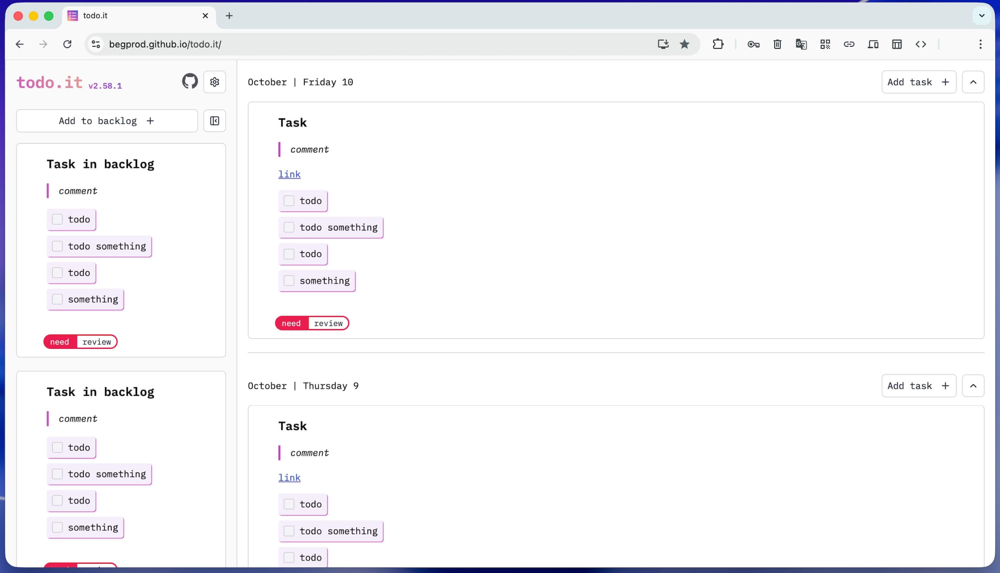

# todo.it – another todo app but with features

App for operational planning and decomposition of tasks for 1-4 weeks ahead


## Idea

The idea of the application is to transform a text file that I used for planning...

```txt
Monday (date)
- task
- task
- task

Tuesday (date)
- task
- task
- task

Wednesday (date)
- task
- task
- task

Thursday (date)
- task
...
...
...

Backlog
- task
- task
- task
  description
...
```

To the interface, for automatization of calendar generating, history of tasks and backlog for future tasks:



## Features

- Automatic calendar generating
- Last 2 month tasks history
- Markdown support (include todo items `- [x] task`)
- Backlog for future tasks
- Create, edit, copy, delete tasks
- Scopes labels for tasks
- Drag'n'drop tasks
- PWA available
- Import/Export data to JSON file
- Works offline

## How data is stored?

For this moment data is stored in local storage of your browser.

## Install application on your device

### iOS

Open the following link on your iPhone or iPad: [https://begprod.github.io/todo.it/](https://begprod.github.io/todo.it/)

Push the button "Share" in the browser menu, then push the button "Add to Home Screen":


### Android

Open the following link on your Android device: [https://begprod.github.io/todo.it/](https://begprod.github.io/todo.it/)

Push the button "Add to Home screen" in the browser menu:


## For developers

### Recommended IDE Setup

[VSCode](https://code.visualstudio.com/) + [Vue - Official](https://marketplace.visualstudio.com/items?itemName=Vue.volar)

### Project Setup

```sh
npm install
```

#### Compile and Hot-Reload for Development

```sh
npm run dev
```

#### Take a look other commands in `package.json`
